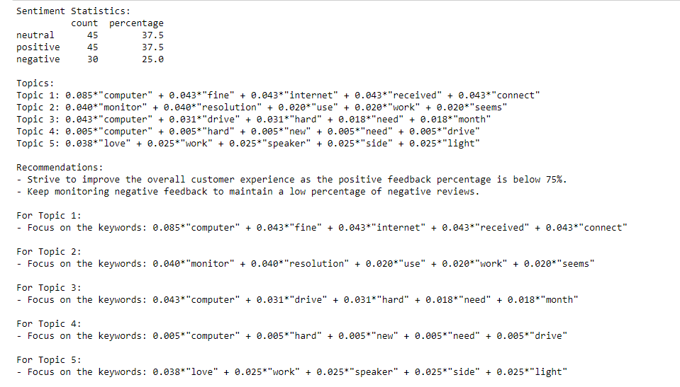

# NLP Recommendation System
This project incorporates sentiment analysis and topic modelling to provide recommendations to the sellers of E-commerce domain.

## Sentiment Analysis
Sentiment Analysis is done through three stages.
1. Data Acquision  
**Selenium** is used to automate Chrome WebDriver to scrape reviews from Amazon product. Four fields of rating, name, date, and text are extracted from the reviews.
2. Data Preprocessing  
**NLTK** and **Pandas** used for eliminating abundant texts. All special characters, digits, stopwards are removed and lemmatized to be constructed as a dataframe.
3. Data Deployment  
**Transformers** by Hugging Face is used to import pre-trained moedels to evaluate the preprocessed data. Here, **cardiffnlp/twitter-roberta-base-sentiment** and **nlptown/bert-base-multilingual-uncased-sentiment** are used.

## Topic modeling
**Gensim** is used to import **LDA** model. LDA model is used to tokenize and create dictionary of words into viable topics.  

